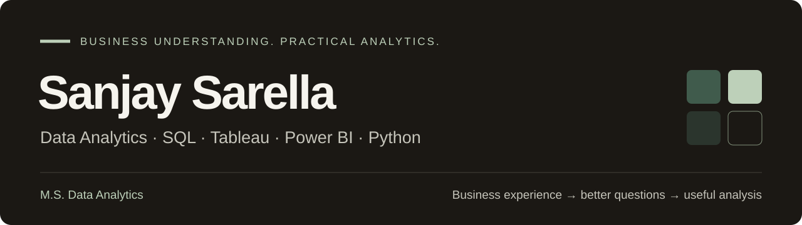

  

<h3 align="center">I like data most when it helps someone make a better decision.</h3>

  <a href="https://sanjaysarella.github.io/">Portfolio</a> &nbsp;·&nbsp;
  <a href="https://sanjaysarella.github.io/assets/Sanjay_Sarella_Resume.pdf">Resume</a> &nbsp;·&nbsp;
  <a href="https://www.linkedin.com/in/sanjaysarella">LinkedIn</a> &nbsp;·&nbsp;
  <a href="mailto:sanjaysarella11@gmail.com">Email</a>

---

### A little about me

I'm a **Data Analytics graduate from Oklahoma City University** with a background in procurement and supply-chain operations. Budgeting, purchasing trends, supplier coordination, and management reporting shaped how I approach data: start with the business question, check the evidence, and make the result understandable.

I work with **SQL, Excel, Tableau, Power BI, Python, and pandas**, building projects in forecasting, customer retention, procurement, and financial research.

**Open to:** Data Analyst, Data Analytics Internship, and Business Analytics opportunities.

### Featured · Agentic Excel Analyst

**Business questions in. Workbook-backed answers out.**

A conversational analytics application that explores unfamiliar Excel workbooks, discovers their structure, and uses controlled SQL and Python analysis to answer questions. It supports cross-sheet analysis, rankings, ratios, temporal comparisons, and answer verification against captured evidence.

`Python` `SQL` `DuckDB` `pandas` `Excel` `FastAPI` `Gemini / Vertex AI`

**[Explore the live application →](https://agentic-excel-analyst-920693785791.us-central1.run.app/#analyst)**

### More applied analytics

| Project | The question behind the work | Explore |
| :--- | :--- | :--- |
| **Retail Demand Forecasting** | What patterns appear across **421,570 weekly sales records and 45 stores**? Sales exploration, forecasting experiments, SHAP, and Power BI reporting. | [Code](https://github.com/SanjaySarella/Retail-demand-forecasting) · [Demo](https://retail-demand-app-646m5mi6fq-uc.a.run.app/) |
| **Customer Churn Intelligence** | What distinguishes customers who leave? EDA on **7,043 customer records**, Random Forest/XGBoost comparison, SHAP, and Tableau visualization. | [Code](https://github.com/SanjaySarella/Customer-Churn-Prediction-Retention-Intelligence) · [Demo](https://churn-intelligence-app-646m5mi6fq-uc.a.run.app/) |
| **Federal Contract Intelligence** | How do public procurement awards differ? A prototype using **969 USASpending records**, nine engineered features, and contract-type classification. | [Code](https://github.com/SanjaySarella/Proposal-win-rate) · [Demo](https://federal-contract-app-646m5mi6fq-uc.a.run.app/) |
| **ORION** | What can filings and economic signals tell us about a company's financial condition? SEC/XBRL research, financial ratios, historical trends, and peer context. | [Code](https://github.com/SanjaySarella/ORION) · [Demo](https://orion-frontend-1027936947898.us-central1.run.app/) |

[See project details and dashboards on my portfolio →](https://sanjaysarella.github.io/#projects)

### How I work with data

| Focus | Tools & methods |
| :--- | :--- |
| **Analysis & reporting** | SQL · Excel · Tableau · Power BI · EDA · KPIs · Dashboard design |
| **Data preparation** | Python · pandas · NumPy · SQLite · DuckDB · APIs |
| **Modeling & interpretation** | scikit-learn · XGBoost · Random Forest · Forecasting · SHAP |

  
Additional application and AI tools

   
  FastAPI · LangGraph · Gemini / Vertex AI · ChromaDB · Docker · Google Cloud Run

---

**Let's connect.** I'm interested in meaningful data, practical business problems, and teams where I can keep learning.

[sanjaysarella11@gmail.com](mailto:sanjaysarella11@gmail.com) · [LinkedIn](https://www.linkedin.com/in/sanjaysarella) · [Portfolio](https://sanjaysarella.github.io/)
